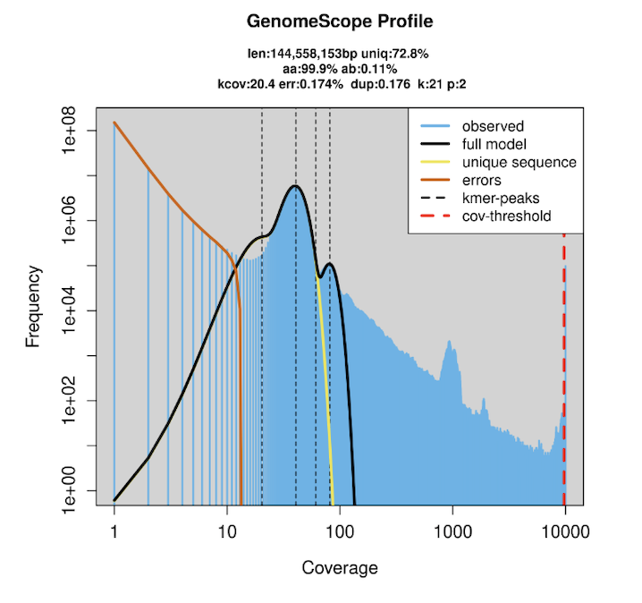
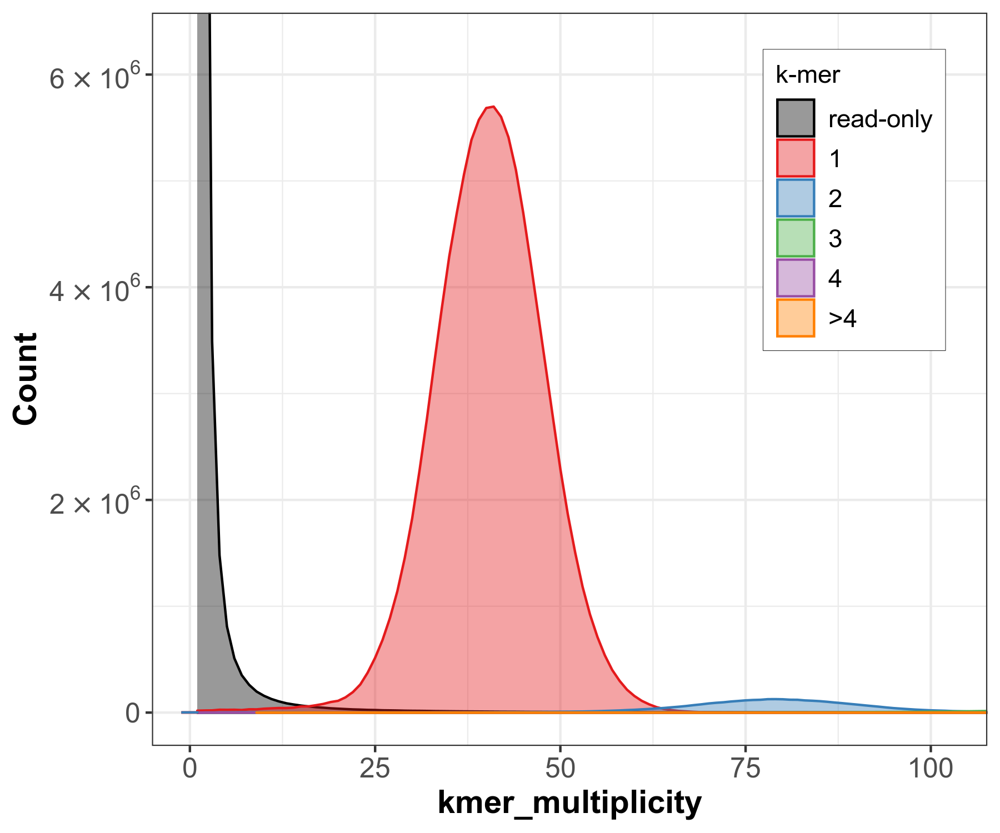
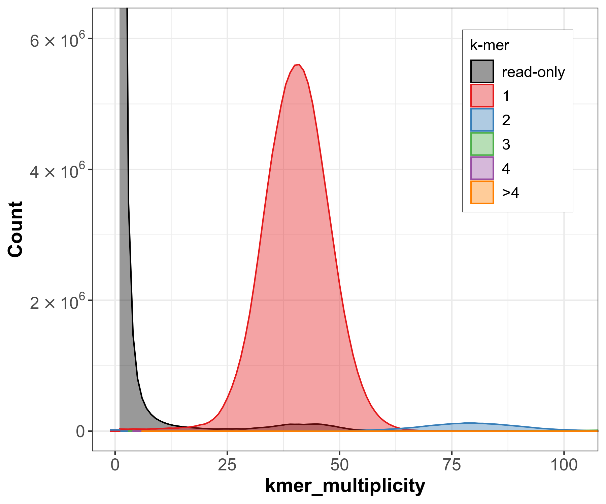
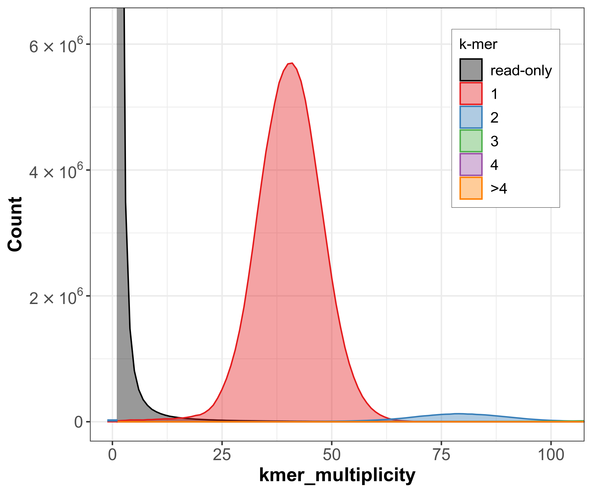
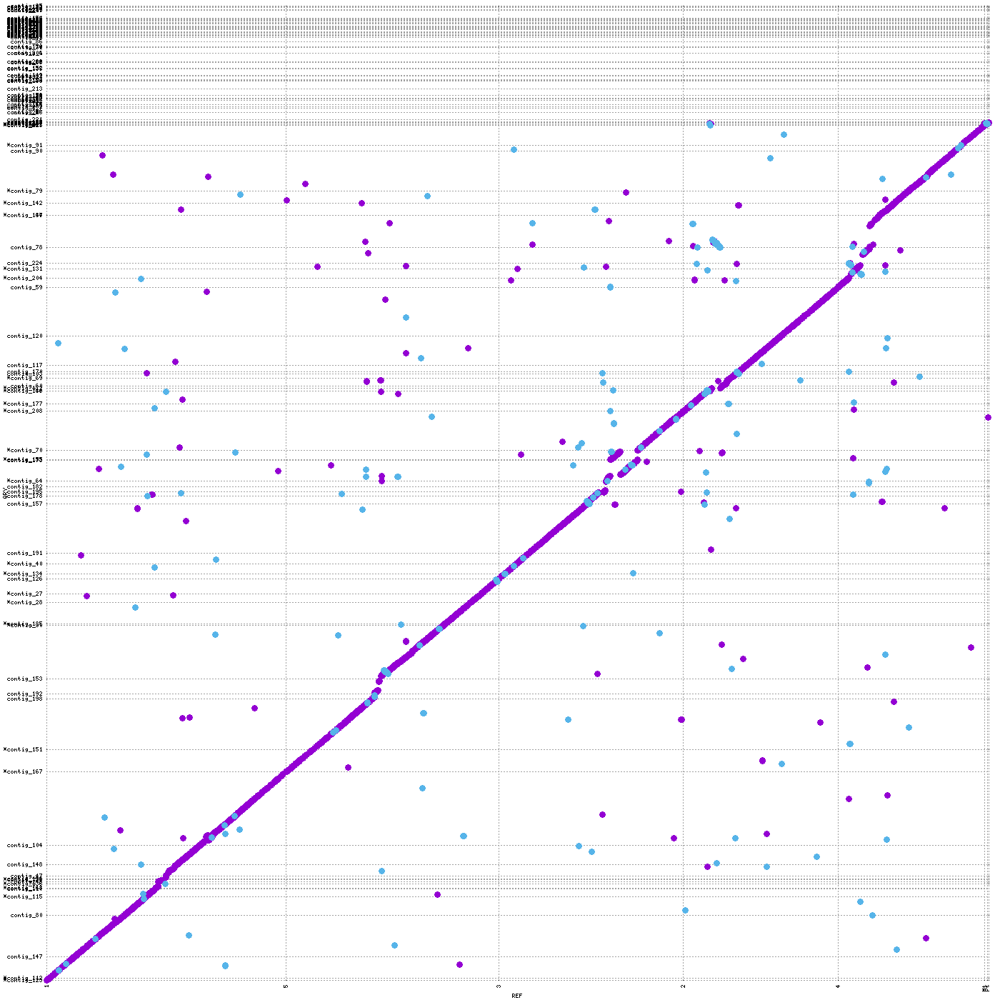
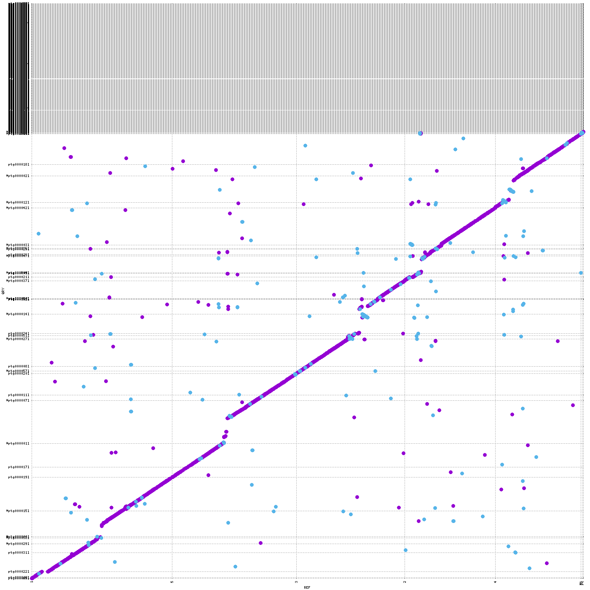
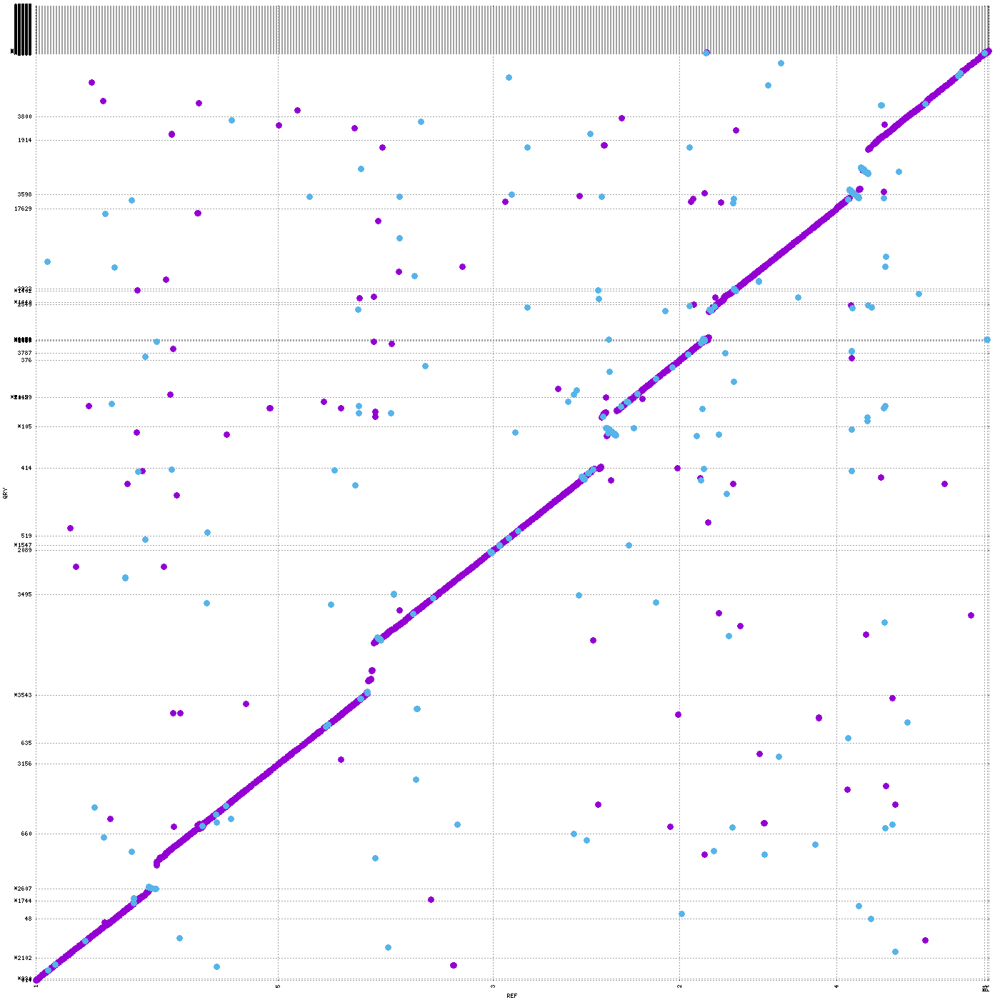

# Assembly and Annotation Course 2026

## Overview

This repository contains my work for the Assembly and Annotation course, including analysis scripts, quality control, genome and transcriptome assembly, and assembly evaluation.

The analyses are performed on the IBU cluster using SLURM. Scripts are numbered and should be run in the order listed under [Workflow](#workflow).

## Dataset

**Assigned accession:** Rab-R1 (*Arabidopsis thaliana*, Madeira genetic group; Lian et al. 2024)

The whole-genome sequencing data for Rab-R1 consist of PacBio HiFi reads:

- `ERR11437340.fastq.gz`

**RNA-seq dataset:** Illumina paired-end RNA-seq from the *A. thaliana* accession Sha (shared by all course participants):

- `ERR754081_1.fastq.gz`
- `ERR754081_2.fastq.gz`

The raw sequencing data are provided by the course and are not stored in this Git repository. Symbolic links are used to access the course data from the project directory.

**Reference genome** (for evaluation only): TAIR10 (Col-0), Ensembl release 57
- `Arabidopsis_thaliana.TAIR10.dna.toplevel.fa`
- `Arabidopsis_thaliana.TAIR10.57.gff3`

## Project structure

```
assembly-annotation-course-2026/
├── README.md
├── .gitignore
├── figures/                       # figures shown in this README
├── scripts/
│   ├── 01_run_fastqc.sh
│   ├── 02_run_fastp.sh
│   ├── 03_run_fastp_pacbio.sh
│   ├── 04_flye_assembly.sh
│   ├── 05_hifiasm_assembly.sh
│   ├── 06_lja_assembly.sh
│   ├── 07_run_jellyfish.sh
│   ├── 08_trinity_assembly.sh
│   ├── 09_run_busco.sh
│   ├── 10_run_quast.sh
│   ├── 11_run_merqury.sh
│   └── 12_run_nucmer_mummerplot.sh
├── read_QC/                       # not tracked (large outputs)
├── assemblies/                    # not tracked
├── assembly_evaluation/           # not tracked
├── genome_comparison/             # not tracked
├── Rab-R1        # course raw data (symlink)
└── RNAseq_Sha    # course raw data (symlink)
```

## Workflow

| Step | Script | Tool (version) | Purpose |
|---|---|---|---|
| 1 | `01_run_fastqc.sh` | FastQC 0.11.9 | Raw read QC |
| 2 | `02_run_fastp.sh` | fastp 0.23.4 | Trim/filter RNA-seq reads |
| 3 | `03_run_fastp_pacbio.sh` | fastp 0.23.4 | PacBio read statistics (no filtering) |
| 4 | `07_run_jellyfish.sh` | Jellyfish 2.3.0 | k-mer counting (k = 21) for GenomeScope 2.0 |
| 5 | `04_flye_assembly.sh` | Flye 2.9.5 | Genome assembly (repeat graph) |
| 6 | `05_hifiasm_assembly.sh` | hifiasm 0.25.0 | Genome assembly (string graph) + GFA→FASTA |
| 7 | `06_lja_assembly.sh` | LJA 0.2 | Genome assembly (multiplex de Bruijn graph) |
| 8 | `08_trinity_assembly.sh` | Trinity 2.15.1 | De novo transcriptome assembly |
| 9 | `09_run_busco.sh` | BUSCO 5.7.1 | Gene-space completeness (brassicales_odb10) |
| 10 | `10_run_quast.sh` | QUAST 5.2.0 | Contiguity and reference-based metrics |
| 11 | `11_run_merqury.sh` | meryl + Merqury 1.3 | k-mer-based QV and completeness (k = 19) |
| 12 | `12_run_nucmer_mummerplot.sh` | MUMmer 4 | Whole-genome alignments and dotplots |

Jellyfish (script 07) is a Week 1 step; it was numbered after the assembly scripts because it was written later.

## Reproducibility

Each analysis step is a separate shell script submitted as a SLURM job on the IBU cluster (partition `pibu_el8`). The scripts specify input/output directories, software modules or containers and their versions, CPU and memory requests, job names, and log files. Containerised tools are run with `apptainer exec --bind /data`.

**Deviations from the script defaults** (resources passed on the command line because of queue load or memory limits):

| Job | Resources used | Reason |
|---|---|---|
| LJA (`06`) | `--mem=128G --time=2-00:00:00` (now in the script) | First run failed with OUT_OF_MEMORY at 64 GB after 17.5 h; peak usage of the successful run was 81 GB |
| BUSCO (`09`) | `sbatch --cpus-per-task=8 --mem=32G --array=0,1,3`, time limit 10 h | Smaller request to start sooner in a full queue; LJA (task 2) run separately after the LJA assembly |
| Merqury (`11`) | `sbatch --cpus-per-task=8`, time limit 10 h | Same reason |
| nucmer (`12`) | `sbatch --cpus-per-task=8 --mem=16G`, time limit 8 h | Same reason |

Evaluation jobs for LJA were submitted with `--dependency=afterok:<LJA job ID>`. Scripts 11 and 12 skip assemblies that are missing or already processed, so they can be rerun safely.

---

## Week 1: Reads and QC

### 1. Basic read statistics

FastQC (`scripts/01_run_fastqc.sh`) was used to assess the PacBio HiFi reads from Rab-R1 and the Illumina RNA-seq reads from Sha.

| Dataset | Total reads | Read length | GC |
|---|---|---|---|
| PacBio ERR11437340 | 556,708 | 56–39,423 bp (mean ≈ 15.2 kb) | 37% |
| RNA-seq R1 ERR754081_1 | 22,620,680 | 101 bp | 46% |
| RNA-seq R2 ERR754081_2 | 22,620,680 | 101 bp | 46% |

The FastQC Basic Statistics module passed for all three datasets. The PacBio reads have a broad read-length distribution, as expected for long-read sequencing, whereas the RNA-seq reads are uniformly 101 bp. The higher GC of the RNA-seq reads reflects the gene-rich content of transcripts.

### 2. Read filtering and trimming

fastp was used to filter and trim the Illumina RNA-seq reads (`scripts/02_run_fastp.sh`) and to obtain statistics for the PacBio HiFi reads without filtering (`scripts/03_run_fastp_pacbio.sh`).

**RNA-seq fastp results (per mate)**

| | Before | After |
|---|---|---|
| Reads | 22,620,680 | 20,352,421 |
| Bases | 2,284,688,680 | 2,043,758,461 |
| Q20 | 88.25% | 94.60% |
| Q30 | 76.19% | 86.32% |

Across both mates: 40,704,842 reads passed; 4,536,276 reads failed due to low quality; 242 failed due to too many Ns; 0 were too short. 2,131,136 reads had adapters trimmed (24,329,968 bases). Duplication rate: 6.61%; insert size peak: 136 bp. Filtered reads and the HTML/JSON reports are in `read_QC/fastp/`.

**PacBio fastp results**

The PacBio HiFi reads were processed without adapter trimming, quality filtering or length filtering; the output reads were discarded to `/dev/null`, because the goal was only to obtain sequencing statistics.

- 556,708 reads
- 8,455,889,868 total bases (~8.46 Gb)
- Q20: 98.56%
- Q30: 96.62%

HiFi reads are already highly accurate, so no trimming was needed.

### 3. Expected PacBio coverage

```
coverage = total sequenced bases / expected genome size
         = 8,455,889,868 / 135,000,000 ≈ 62.6×
```

### 4. K-mer counting and GenomeScope

K-mers were counted from the PacBio HiFi reads with Jellyfish 2.3.0 (`scripts/07_run_jellyfish.sh`), using k = 21 and canonical k-mers (`-C`). The histogram (`read_QC/kmer_counting/ERR11437340.k21.histo`) was analysed with GenomeScope 2.0 (k = 21, ploidy = 2).

| Metric | Result |
|---|---|
| Estimated genome size | ~144.6 Mb |
| Unique sequence content | 72.8% |
| Heterozygosity | 0.11% |
| kcov (haploid k-mer coverage) | 20.4× |
| Sequencing error rate | 0.174% |
| Duplication | 0.176 |



**Interpretation**

- **Peaks.** The steep peak at very low coverage consists of k-mers containing sequencing errors. GenomeScope's kcov (20.4×) is the haploid k-mer coverage. The homozygous peak is therefore expected at 2 × kcov ≈ 41×, which matches the main observed peak at ~40×. The small shoulder at ~20× corresponds to heterozygous k-mers.
- **Heterozygosity.** 0.11% is very low, as expected for *A. thaliana*: it is predominantly self-fertilising, so accessions are nearly homozygous.
- **Genome size.** 144.6 Mb is ~7% above the ~135 Mb expected; k-mer estimates are sensitive to repeat content and to the coverage cutoffs used.
- **Coverage: 62.6× vs ~40×.** For long reads, k-mer coverage is close to base coverage, so the difference is not due to the k-mer length. The total base count also includes reads from organelles (chloroplast, mitochondria) and high-copy repeats (rDNA, centromeric satellites), which appear as the high-multiplicity tail (1,000–10,000×) in the log-scale GenomeScope plots. The ~40× peak is therefore the effective single-copy nuclear coverage. The weighted mean multiplicity of the histogram (61.57×) is dominated by error k-mers and high-copy k-mers and is not a meaningful coverage estimate; its similarity to 62.6× is likely coincidental.

### Week 1 questions

**What are the read lengths of the different datasets?** PacBio HiFi: 56–39,423 bp (mean ≈ 15.2 kb). RNA-seq: 101 bp.

**Are the datasets of good quality?** Yes. FastQC Basic Statistics passed for all datasets, and 96.6% of HiFi bases are ≥ Q30.

**How many RNA-seq reads were trimmed or filtered? Did the quality improve?** 4,536,518 reads failed filtering across both mates (4,536,276 low quality, 242 too many Ns), and 2,131,136 reads had adapter trimming. Q30 increased from 76.19% to 86.32%.

**What is the expected PacBio coverage?** ~62.6× (total bases / 135 Mb); effective single-copy k-mer coverage ~40×.

**What are canonical k-mers?** A k-mer and its reverse complement are counted as the same k-mer (Jellyfish `-C`). This is needed because reads come from both DNA strands, and we do not know which strand a given read was sequenced from.

---

## Week 2: Genome and transcriptome assembly

### Genome assemblies

Three assemblers were run on the same HiFi reads (`scripts/04`–`06`). hifiasm writes GFA; the primary contigs (`Rab-R1.bp.p_ctg.gfa`) were converted to FASTA with `awk '/^S/{print ">"$2;print $3}'`.

| Metric | Flye | hifiasm (primary) | LJA |
|---|---|---|---|
| Total length | 147.2 Mb | 188.9 Mb | 155.6 Mb |
| Contigs | 170 | 1,233 | 763 |
| Largest contig | 11.11 Mb | 14.18 Mb | 16.03 Mb |
| N50 | 3.31 Mb | 6.41 Mb | — |
| NG50 (G = 135 Mb) | 4.40 Mb | 8.42 Mb | 8.84 Mb |
| Run time / peak memory | 4.3 h / 34 GB | 51 min / 18 GB | 18.4 h / 81 GB |

- **Flye** produced an assembly close to the GenomeScope estimate (144.6 Mb), but it is the least contiguous.
- **hifiasm** is ~44 Mb larger than expected, with many small contigs (see QUAST duplication ratio and BUSCO below).
- **LJA** reached the highest NG50 but required far more memory: 64 GB was not enough.

### Transcriptome assembly (Trinity)

Trinity 2.15.1 was run on the fastp-trimmed Sha RNA-seq reads (`scripts/08_trinity_assembly.sh`).

| Metric | Value |
|---|---|
| Trinity "genes" | 25,125 |
| Transcripts | 42,566 (~1.7 isoforms per gene) |
| Contig N50 | 1,876 bp |
| Total assembled bases | 57.4 Mb (GC 41.9%) |
| Run time / peak memory | 4.4 h / 34 GB |

The number of Trinity "genes" is close to the ~27,000 protein-coding genes annotated in *A. thaliana*.

### Week 2 questions

**What is the difference between a contig and a scaffold?** A contig is a continuous, gap-free sequence built from overlapping reads. A scaffold is a set of contigs ordered and oriented using additional information (paired/mate-pair reads, Hi-C, optical maps or a reference), with gaps between them filled with Ns.

**Why can repeats make assembly difficult, and why are long reads useful?** Repeats occur in several places, so reads from them fit in multiple positions and create branches in the assembly graph; the assembler cannot tell which unique flanks are connected. A repeat can only be resolved if a read spans it completely and reaches unique sequence on both sides. Long reads span most repeats.

**What happens at very low or very high coverage?** Low coverage leaves regions unsequenced (Lander–Waterman: gaps decrease exponentially with coverage), giving fragmented assemblies and lower base accuracy. Very high coverage increases compute time and memory and accumulates more erroneous and redundant reads, which can complicate the graph without improving the result.

**What is the role of error correction? Is it needed for HiFi?** Error correction removes sequencing errors so that true overlaps are found and the correct sequence is reconstructed (errors create bubbles and tips in the graph). HiFi reads are already ~99.9% accurate, so separate error correction is usually not necessary.

**Why record the exact command, version and parameters?** For reproducibility. Algorithms and default parameters change between versions, and the same data can give different assemblies; exact records also make troubleshooting possible.

**Why might two students obtain different assemblies from the same reads?** Different software versions, parameters, read preprocessing, or resources; some steps are also non-deterministic, for example because of multithreading.

**What is the fundamental difference between genome and transcriptome assembly?** A genome assembly reconstructs the DNA of the organism; it is (ideally) one sequence per chromosome with roughly uniform coverage. A transcriptome assembly reconstructs the RNA transcripts expressed in a particular sample, which depends on tissue, developmental stage and condition.

**Why is transcriptome assembly more complicated than assembling all reads into one sequence?** Alternative splicing produces several transcripts per gene that share exons, so the assembler must decide which exon combinations are real. Expression levels vary by orders of magnitude between genes, and reads from paralogs can be confused.

---

## Week 3: Assembly evaluation and comparison

### BUSCO (brassicales_odb10, n = 4,596)

| Assembly | Complete | Single | Duplicated | Fragmented | Missing |
|---|---|---|---|---|---|
| Flye | 100.0% | 99.0% | 1.0% | 0.1% | 0.1% |
| hifiasm | 98.1% | 97.1% | 1.0% | 0.0% | 1.9% |
| LJA | 100.0% | 99.0% | 1.0% | 0.1% | 0.1% |
| Trinity (transcriptome) | 78.8% | 39.4% | 39.4% | 3.6% | 17.6% |

Flye and LJA recover essentially the full gene space; hifiasm misses 1.9% of BUSCOs despite being the largest assembly. In all three genome assemblies duplicated BUSCOs are only 1.0%, so hifiasm's extra sequence is not duplicated genes. Trinity's high duplicated fraction is expected: several isoforms of one gene are each counted as a copy. Its missing BUSCOs correspond to genes not expressed in the sequenced sample.

### QUAST (with TAIR10 reference)

| Metric | Flye | hifiasm | LJA |
|---|---|---|---|
| NG50 (reference length) | 5.91 Mb | 8.72 Mb | 10.10 Mb |
| Genome fraction | 87.7% | 86.2% | 87.8% |
| Duplication ratio | 1.064 | 1.479 | 1.133 |
| Misassemblies | 4,908 | 5,035 | 5,678 |

- **Duplication ratio.** hifiasm's ratio of 1.48 means ~48% more aligned sequence than reference covered, confirming that its extra length is redundant sequence. Together with the 1% duplicated BUSCOs, this indicates that the duplicates are non-genic, most likely repeat-rich regions.
- **Misassemblies and genome fraction.** Rab-R1 is a different accession from the Col-0 reference, so real structural variants and divergent repeat regions (e.g. centromeres) are counted as "misassemblies" and lower the genome fraction. These values are therefore only useful for comparing the three assemblers, not as absolute error counts.

### Merqury (k = 19, read k-mers from HiFi data)

| Assembly | QV | k-mer completeness |
|---|---|---|
| Flye | 61.6 | 99.00% |
| hifiasm | 52.7 | 97.43% |
| LJA | 50.3 | 99.07% |

Flye has the highest consensus accuracy (QV 61.6 ≈ 1 error per 1.4 Mb). hifiasm has lower k-mer completeness despite its larger size: the extra sequence is redundant, and some genome sequence is missing.

| Flye | hifiasm | LJA |
|---|---|---|
|  |  |  |

In all three assemblies, most k-mers are present once in the assembly (red), with a single peak at ~40×, the same coverage as the GenomeScope homozygous peak. The grey peak at low multiplicity corresponds to sequencing-error k-mers found only in the reads, as expected. The small blue hump at ~80× (k-mers present twice in the assembly at twice the coverage) represents genuine two-copy sequence and looks the same for all three assemblers. Only hifiasm shows a grey bump under the main red peak (~25–55×): these are genuine genomic k-mers that are missing from the assembly, consistent with its lower k-mer completeness (97.4% vs ~99%) and 1.9% missing BUSCOs. hifiasm shows no 2-copy (blue) peak at ~40×, so its extra ~44 Mb is not a duplicated copy of single-copy regions (no retained haplotigs). Together with the QUAST duplication ratio (1.48), this suggests the redundant sequence comes from repetitive regions.

### Whole-genome alignment (nucmer + mummerplot)

Each assembly was aligned to TAIR10, and the assemblies were aligned pairwise (`--breaklen 1000 --mincluster 1000`).

| Flye vs TAIR10 | hifiasm vs TAIR10 | LJA vs TAIR10 |
|---|---|---|
|  |  |  |

All three assemblies are highly collinear with TAIR10: each of the five chromosomes appears as a near-continuous forward-strand diagonal (purple), and no large inversions or translocations along the chromosome arms are visible at this scale. The diagonal is split into several contig blocks, with small offsets and gaps mostly at chromosome ends and pericentromeric regions, where repeats (centromeric satellites, rDNA) are hard to assemble and differ most between accessions. The scattered off-diagonal points (forward and reverse) are short matches to repetitive elements such as transposons. Many short contigs at the top of the y-axis do not align along the diagonal. There are noticeably more of these for hifiasm, consistent with its large number of small, redundant contigs. Overall, the large-scale genome structure of Rab-R1 matches Col-0, in line with Lian et al. (2024), who found the A. thaliana karyotype to be highly conserved, with rearrangements concentrated around centromeres.

### Summary

- All three assemblers recovered the gene space almost completely (BUSCO ≥ 98%), so they differ mainly in repetitive, non-genic regions.
- There is a trade-off between contiguity and accuracy: LJA is the most contiguous (highest NG50) but has the lowest QV; Flye is the most accurate (highest QV, size closest to expectation) but the least contiguous.
- hifiasm inflated the assembly by ~44 Mb with redundant, non-genic sequence (duplication ratio 1.48, BUSCO D 1%). This is consistent with the purging step (purge_dups) applied to hifiasm output in the published *A. thaliana* pan-genome (Lian et al. 2024).
- LJA required > 64 GB of memory (peak 81 GB) for this ~145 Mb genome at ~60× coverage.
- The same patterns were observed across the other accessions in our group, indicating that they reflect the assemblers rather than the Rab-R1 sample.

## References

- Lian, Q. et al. (2024). A pan-genome of 69 *Arabidopsis thaliana* accessions reveals a conserved genome structure throughout the global species range. *Nature Genetics*, 56, 982–991.
- Jiao, W. B. & Schneeberger, K. (2020). Chromosome-level assemblies of multiple *Arabidopsis* genomes reveal hotspots of rearrangements with altered evolutionary dynamics. *Nature Communications*, 11, 989.
- Ranallo-Benavidez, T. R., Jaron, K. S. & Schatz, M. C. (2020). GenomeScope 2.0 and Smudgeplot for reference-free profiling of polyploid genomes. *Nature Communications*, 11, 1432.
- Kolmogorov, M. et al. (2019). Assembly of long, error-prone reads using repeat graphs. *Nature Biotechnology*, 37, 540–546.
- Cheng, H. et al. (2021). Haplotype-resolved de novo assembly using phased assembly graphs with hifiasm. *Nature Methods*, 18, 170–175.
- Bankevich, A. et al. (2022). Multiplex de Bruijn graphs enable genome assembly from long, high-fidelity reads. *Nature Biotechnology*, 40, 1075–1081.
- Grabherr, M. G. et al. (2011). Full-length transcriptome assembly from RNA-Seq data without a reference genome. *Nature Biotechnology*, 29, 644–652.
- Manni, M. et al. (2021). BUSCO update. *Molecular Biology and Evolution*, 38, 4647–4654.
- Mikheenko, A. et al. (2018). Versatile genome assembly evaluation with QUAST-LG. *Bioinformatics*, 34, i142–i150.
- Rhie, A. et al. (2020). Merqury: reference-free quality, completeness, and phasing assessment for genome assemblies. *Genome Biology*, 21, 245.
- Marçais, G. et al. (2018). MUMmer4: a fast and versatile genome alignment system. *PLoS Computational Biology*, 14, e1005944.

GenomeScope 2.0.

